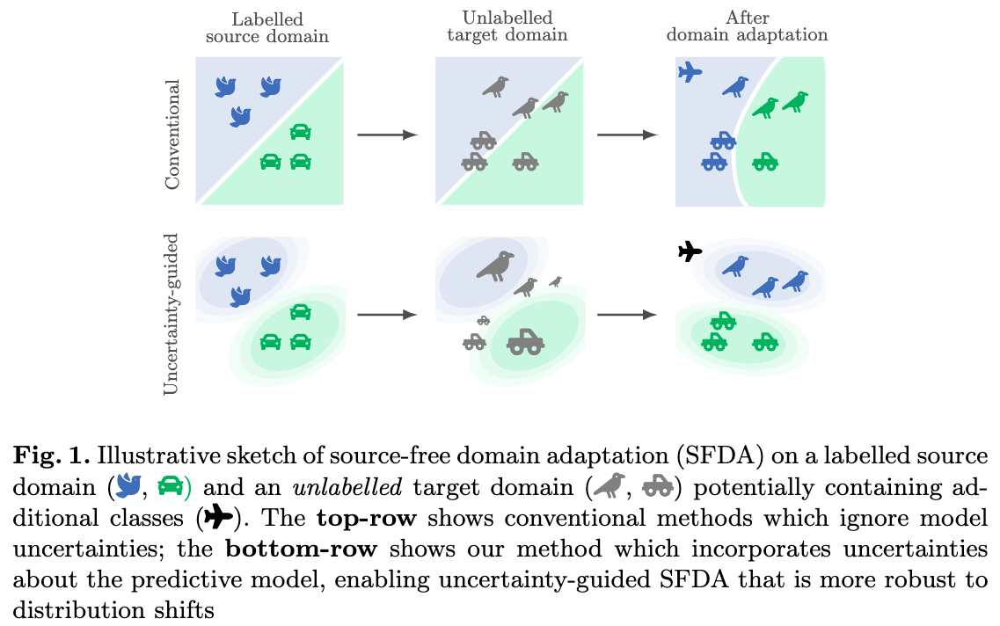
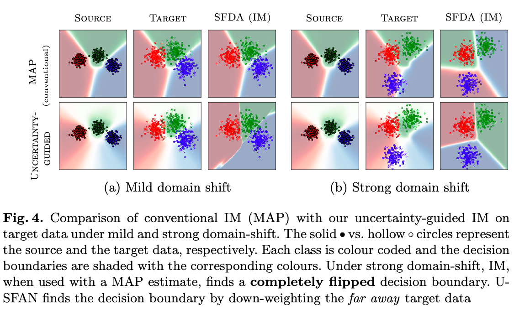
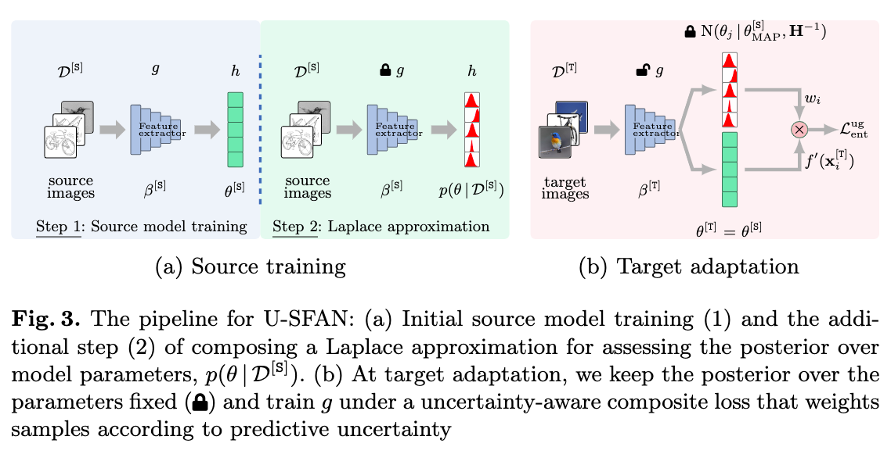

# Uncertainty-guided Source-free Domain Adaptation (ECCV 2022)
> Subhankar Roy, Martin Trapp, Andrea Pilzer, Juho Kannala, Nicu Sebe, Elisa Ricci and Arno Solin

**Abstract**: Source-free domain adaptation (SFDA) aims to adapt a classifier to an unlabelled target data set by only using a pre-trained source model. 
However, the absence of the source data and the domain shift makes the predictions on the target data unreliable. 
We propose quantifying the uncertainty in the source model predictions and utilizing it to guide the target adaptation. 
For this, we construct a probabilistic source model by incorporating priors on the network parameters inducing a distribution 
over the model predictions. Uncertainties are estimated by employing a Laplace approximation and incorporated to identify 
target data points that do not lie in the source manifold and to down-weight them when maximizing the mutual information 
on the target data. Unlike recent works, our probabilistic treatment is computationally lightweight, decouples source 
training and target adaptation, and requires no specialized source training or changes of the model architecture. 
We show the advantages of uncertainty-guided SFDA over traditional SFDA in the closed-set and open-set settings and 
provide empirical evidence that our approach is more robust to strong domain shifts even without tuning.



## MAP vs Uncertainty-guided Target Adaptation


## Pipeline of Uncertainty-guided Source-free Domain Adaptation (U-SFAN)


## Installation
``` pip install -r requirements.txt ```

## Toy-classification problem

``` cd toy_classification/ ```

### Mild-shift

SHOT-IM
``` python multiclass_shot.py --method shot ```

U-SFAN
``` python multiclass_shot.py --method usfan ```

### Strong-shift
SHOT-IM
``` python multiclass_shot.py --method shot --strong_shift ```

U-SFAN
``` python multiclass_shot.py --method usfan --strong_shift ```

## Image Datasets
Coming soon...
